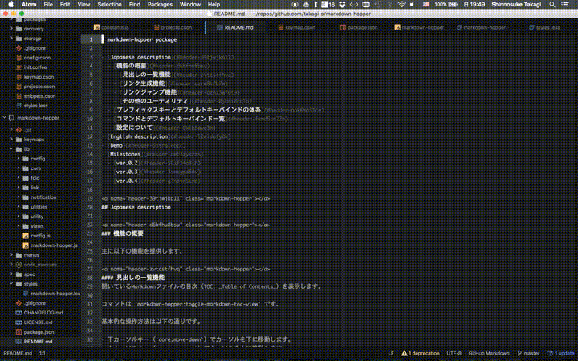

# markdown-hopper package

- [Japanese description](#header-39tjwjka11)
  - [機能の概要](#header-d6bfhu8bsu)
    - [見出しの一覧機能](#header-zvtcstfhvq)
    - [リンク生成機能](#header-dzrw8t2b7w)
    - [リンクジャンプ機能](#header-oznz3wf6t9)
    - [その他のユーティリティ](#header-0jhai0cq1b)
  - [プレフィックスキーとデフォルトキーバインドの体系](#header-nok6mp31cp)
  - [コマンドとデフォルトキーバインド一覧](#header-fxnd5cn22h)
  - [設定について](#header-0klh5ave3m)
- [English description](#header-l2widefy0k)
- [Demo](#header-5xtrgleocc)
- [Milestones](#header-det3zykzms)
  - [ver.0.2](#header-59zf34a3th)
  - [ver.0.3](#header-3sncgpd88v)
  - [ver.0.4](#header-g7nbvr5tmp)

## Japanese description

### 機能の概要

主に以下の機能を提供します。

#### 見出しの一覧機能
開いているMarkdownファイルの目次（TOC: _Table of Contents_）を表示します。

コマンドは `markdown-hopper:toggle-markdown-toc-view` です。

基本的な操作方法は以下の通りです。

- 下カーソルキー（`core:move-down`）でカーソルを下に移動します。
- 上カーソルキー（`core:move-up`）でカーソルを上に移動します。
- Enterキー（`core:confirm`）で、選択している見出し行をエディタで開きます。
- Escapeキー（`core:cancel`）で、表示している目次を閉じます。

##### ヘッダーのレベルによる絞り込み
入力欄に `#` を複数続けて入力して見出しのレベルを指定することで、
レベル1から指定したレベルまでの見出しのみを絞り込んで表示します。

文書の大枠の構造を理解したいときに便利です。

##### 単語による絞り込み
入力欄に単語を入力することで、指定した単語を含む見出しを絞り込んで表示します。

各検索結果の中央には、ヒットした見出しが表示されます。

各検索結果の右上部には、ヒットした見出しの上位の見出しが順番に表示されます。
（より上位のものから順番に、左から表示されます。）

各検索結果の右下部には、ヒットした見出しの行数が表示されます。

##### Emacsキーバインドに慣れている方へのおまけ
専用のパッケージを入れている方もいるかもしれませんが、
一応以下のキーバインドが有効になっています。
（他のパッケージとのキーバインドの衝突などが発生するため）

| キーバインド |     コマンド     |
|:------------:|:----------------:|
|   `ctrl-n`   | `core:move-down` |
|   `ctrl-p`   |  `core:move-up`  |
|   `ctrl-m`   |  `core:confirm`  |
|   `ctrl-g`   |  `core:cancel`   |

#### リンク生成機能

##### ファイルへのMarkdownリンク生成機能
アクティブになっているペインで開いているファイルへのMarkdownリンクを生成することができます。

この場合には、以下の2つのコマンドを利用します。

- `markdown-hopper:create-link-to-file`
- `markdown-hopper:paste-link`

`create-link-to-file`を実行すると、アクティブになっているペインで開いているファイルの絶対パスがメモリ上に保存されます。

ファイルの絶対パスがメモリ上に保存された状態で、
別のMarkdownファイル上で`paste-link`を実行すると、
`create-link-to-file`を実行したファイルへのMarkdownリンクが生成されます。

###### リンクのパス
生成されるリンクのパスは、以下の2つの情報をもとに計算した相対パス指定となります。

- `create-link-to-file`を実行したファイルの絶対パス
- `paste-link`を実行したファイルの絶対パス

###### リンクのタイトル
以下の2つから設定することができます。

- ファイルの最初の見出しをリンクのタイトルとして用いる
- ファイル名をリンクのタイトルとして用いる

なお、ファイルに見出しが存在しない場合は、自動的にファイル名がリンクのタイトルとして用いられます。

貼り付け直後には、リンクのタイトル部分が選択されている状態になっているため、
タイトルの変更も最低限のキーストロークで行えます。

###### 画像ファイルへのリンク貼り付け
`create-link-to-file`を実行したファイルが画像ファイルである場合は、
貼り付けられるリンク形式も画像ファイルになります。

##### 見出しへのリンク生成機能
Markdownを開いているとき、カーソルがあるセクションの見出しの上に、
ランダム生成された10文字の文字列を`name`とした`<a>`タグを自動生成することができます。
（実際には、`name`の値は`header-{ランダム文字列}`の形式になります）

コマンドは`markdown-hopper:create-link-to-header`です。

自動生成した`<a>`タグの情報は、[ファイルへのMarkdownリンク生成機能](#header-ixwq6ghhh1)と同様にメモリ上に保持されます。

この状態で、前述した`paste-link`を実行すると、メモリ上に保持した`<a>`タグの`name`の値の先頭に`#`記号を付加した文字列をリンク先として、
Markdownリンクが生成されます。
（リンクのタイトルは見出しと同一の文字列になります。）

この見出しへのMarkdownリンクは、異なるMarkdownファイルであっても、貼り付けることができます。
その際の振る舞いはファイルへのMarkdownリンク生成機能とほぼ同様ですが、
リンクのタイトルは`ファイルへのリンクのタイトル | ヘッダーへのリンクのタイトル` という文字列になります。

この生成されたリンクは、MarkdownをHTMLに変換しても期待通りにリンクとして動作します。

##### リンクを利用した目次生成機能
前のセクションで述べた見出しへのリンク生成機能を利用すると、
Markdownファイルの目次を作成することができます。

1つ1つのセクション毎に`create-link-to-header`と`paste-link`を実行するのは大変なので、
`markdown-hopper:create-table-of-contents`というコマンドを用意しています。
このコマンドを実行することで、`create-table-of-contents`を実行したファイルのすべての見出しに対して、
`create-link-to-header`が実行され、それらの見出しがまとめてメモリ上に保持されます。

メモリ上に保持された目次の情報は、`markdown-hopper:paste-table-of-contents`で、貼り付けることができます。
貼り付けられる目次は、各見出しのレベルに応じてインデントされたMarkdownリストの形式になっています。

`create-link-to-header`と同様、この機能は異なるファイル間でも利用できるため、
目次用のファイルを別ファイルとして作成することも可能です。

###### 見出しのレベルを指定した目次生成
`paste-table-of-contents`には、以下のようにほぼ同様の動作をするコマンドがあります。

- `paste-table-of-contents-level-2`: レベル2（`##`）の見出しまでの目次を作成
- `paste-table-of-contents-level-3`: レベル3（`###`）の見出しまでの目次を作成
- `paste-table-of-contents-level-4`: レベル4（`####`）の見出しまでの目次を作成
- `paste-table-of-contents-level-5`: レベル5（`#####`）の見出しまでの目次を作成
- `paste-table-of-contents-level-6`: レベル6（`######`）の見出しまでの目次を作成

##### Webページのリンク貼り付け機能
このセクションの他の機能は**ローカルファイルへのリンク**を扱うための機能でしたが、
OSのクリップボードにURIをコピーした状態で`markdown-hopper:paste-http-link`を利用すると、
内部でそのURLにリクエストを送り、レスポンスの`head > title`の値を読み込んで、
Markdownリンクを貼り付けることができます。
（`https`プロトコルには対応していますが、認証が必要なURLの場合には対応できていません。
メジャーなサイトであればそのうち対応するかもしれません）

#### リンクジャンプ機能
前のセクションまでは**リンクの生成**に関する機能の説明でしたが、
このセクションでは**リンクのジャンプ**を行うための機能について説明します。

リンク生成の機能ほどは複雑でないため、すぐに理解できると思います。

主に以下の2つのコマンドを使います。

- `markdown-hopper:jump-forward`
- `markdown-hopper:jump-backward`

`jump-forward`を使うことで、そのカーソル行にMarkdownリンクを含んでいる場合に、そのリンク先をエディタで開くことができます。

また、`jump-backward`を使うことで、`jump-forward`してきた履歴を逆に辿ることができます。

`jump-forward`の履歴は、`markdow-hopper:jump-histories`で見ることができ、ジャンプ元のファイル名・ジャンプ元の行の文字列を対象に、検索を行うこともできます。

なお、リリース直後の時点では、外部のウェブサイトへ`jump-forward`することはできません。

#### その他のユーティリティ

##### fold機能
人がMarkdownを読む上で可読性を下げがちな、Markdwonリンクのリンク先URIや、
このパッケージによって生成されたアンカータグなどをfoldすることができます。

動作については、細かい設定が可能になっています。

### プレフィックスキーとデフォルトキーバインドの体系

`Ctrl-c Ctrl-m` がデフォルトのプレフィックスキーになっています。

プレフィックスキーに続けて打つキーによって、大まかに機能が分かれます。
  - `(Ctrl-c Ctrl-m) Ctrl-l` : リンク生成系の機能
  - `(Ctrl-c Ctrl-m) Ctrl-p` : 生成したリンクのペースト系の機能
  - `(Ctrl-c Ctrl-m) Ctrl-f` : fold系の機能
  - `(Ctrl-c Ctrl-m) Ctrl-m` : その他のMarkdown用のユーティリティ系の機能

なお、大部分の操作は上記の体系に即したキーバインドによって行うことができますが、例外として以下があります。
  - `(Ctrl-c Ctrl-m) Ctrl-o` : カーソル行にあるMarkdownリンクのリンク先へジャンプ
  - `(Ctrl-c Ctrl-m) o` : ジャンプ後に、リンク元へ戻る

### コマンドとデフォルトキーバインド一覧

| Commands                          | Default Keybinds                       | Despcription                             | Demo links                 |
|:----------------------------------|:---------------------------------------|:-----------------------------------------|:---------------------------|
| `toggle-markdown-toc-view`        | `(Ctrl-c Ctrl-m) Ctrl-t`               | Show **T**oC                             |                            |
| `create-link-to-file`             | `(Ctrl-c Ctrl-m) Ctrl-l Ctrl-f`        | Register **L**ink to the **F**ile        |                            |
| `create-link-to-header`           | `(Ctrl-c Ctrl-m) Ctrl-l Ctrl-h`        | Register **L** to the **H**eader         |                            |
| `paste-link`                      | `(Ctrl-c Ctrl-m) Ctrl-p Ctrl-l`        | **P**aste registered **L**ocal link      |                            |
| `paste-http-link`                 | `(Ctrl-c Ctrl-m) Ctrl-p Ctrl-p`        | **P**aste **P**ublic link from clipboard |                            |
| `create-table-of-contents`        | `(Ctrl-c Ctrl-m) Ctrl-l Ctrl-t`        | Register **L**inks of TOC to memroy      | [Demo](#header-5xtrgleocc) |
| `paste-table-of-contents`         | `(Ctrl-c Ctrl-m) Ctrl-p Ctrl-t Ctrl-t` | **P**aste registered **T**OC             | [Demo](#header-2ramzssjsu) |
| `paste-table-of-contents-level-2` | `(Ctrl-c Ctrl-m) Ctrl-p Ctrl-t 2`      |                                          |                            |
| `paste-table-of-contents-level-3` | `(Ctrl-c Ctrl-m) Ctrl-p Ctrl-t 3`      |                                          |                            |
| `paste-table-of-contents-level-4` | `(Ctrl-c Ctrl-m) Ctrl-p Ctrl-t 4`      |                                          |                            |
| `paste-table-of-contents-level-5` | `(Ctrl-c Ctrl-m) Ctrl-p Ctrl-t 5`      |                                          |                            |
| `paste-table-of-contents-level-6` | `(Ctrl-c Ctrl-m) Ctrl-p Ctrl-t 6`      |                                          |                            |
| `jump-forward`                    | `(Ctrl-c Ctrl-m) Ctrl-o`               | **O**pen link                            |                            |
| `jump-backward`                   | `(Ctrl-c Ctrl-m) o`                    | **O**pen previous                        |                            |
| `toggle-fold`                     |                                        |                                          |                            |
| `toggle-fold-anchors`             |                                        |                                          |                            |
| `fold-links`                      |                                        |                                          |                            |
| `fold-all`                        | `(Ctrl-c Ctrl-m) Ctrl-f Ctrl-f`        |                                          |                            |

### 設定について

| 設定項目   |                                                                                        |
|:-----------|:---------------------------------------------------------------------------------------|
| 通知レベル | 通知をどの程度表示するかを設定できます。初めて使う人には、通知が多い方が良いでしょう。 |

## English description
Coming soon

## Demo

## Milestones

### ver.0.2
* リファクタリング
* READMEの整備

### ver.0.3
* 登録したリンクの一覧表示
* 登録したリンク一覧からリンクをペースト
* 辿ってきたリンクの一覧表示
* 辿ってきたリンク一覧からリンクに飛ぶ
* 単語絞り込み時の、祖先のヘッダを含めた検索
* Page up, Page down
* Go to beginning, Go to ending

### ver.0.4
* Markdown Previewのリンクをクリックした際に、相対パスを辿ってプレビューできるようにする
* スタイルの修正
